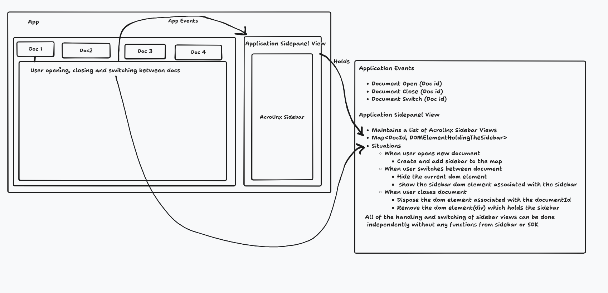

# Acrolinx Sidebar SDK: Sidebar Persistence Troubleshooting Guide

## Legal Notice and Usage Restrictions

**CONFIDENTIAL AND PROPRIETARY**

This document and all associated materials are the intellectual property of Acrolinx GmbH. All rights reserved.

**Usage Restrictions:**
- This document is provided exclusively for support and use within the current project engagement
- No part of this document may be reproduced, distributed, or transmitted in any form or by any means without prior written permission from Acrolinx GmbH
- This material is confidential and proprietary to Acrolinx GmbH and is intended solely for the authorized recipient
- Any unauthorized use, reproduction, or distribution is strictly prohibited

**Copyright Notice:**
© 2025 Acrolinx GmbH. All rights reserved.

---

## Overview

This guide addresses the issue where the Acrolinx Sidebar retains check results from previous articles when opened on new content. This is a common problem in CMS environments where the sidebar is reused across different articles or documents.

## Problem Description

**Symptom**: When a user closes the Acrolinx Sidebar after checking one article and then opens it again on a new article, the sidebar still displays the check results from the previous article instead of showing a clean state for the new content.

**Expected Behavior**: Each time the sidebar is opened on new content, it should start fresh without any previous check results.

## Root Causes and Solutions

### 1. Sidebar Instance Reuse

**Problem**: The same sidebar instance is being reused across different articles without proper cleanup.

**Solution**: Properly dispose of the sidebar instance when switching between articles.

```javascript
// Problem: Reusing the same plugin instance
let acrolinxPlugin = new AcrolinxPlugin(config);

// Solution: Dispose and recreate for each article
function switchToNewArticle() {
  // Dispose the current instance
  acrolinxPlugin.dispose(() => {
    console.log('Sidebar disposed successfully');
    
    // Create new instance for the new article
    acrolinxPlugin = new AcrolinxPlugin(config);
    const adapter = new ContentEditableAdapter({ element: editorElement });
    acrolinxPlugin.registerAdapter(adapter);
    acrolinxPlugin.init();
  });
}
```

### 2. Missing Sidebar Container Cleanup

**Problem**: The sidebar container is not properly cleared when switching articles.

**Solution**: Ensure complete cleanup of the sidebar container.

```javascript
// Problem: Incomplete cleanup
acrolinxPlugin.dispose(() => {
  // Container might still have stale content
});

// Solution: Complete container cleanup
acrolinxPlugin.dispose(() => {
  const sidebarContainer = document.getElementById('sidebar-container');
  if (sidebarContainer) {
    // Clear all content including any hidden elements
    sidebarContainer.innerHTML = '';
    
    // Remove any event listeners or references
    sidebarContainer.replaceWith(sidebarContainer.cloneNode(true));
  }
});
```

### 3. Browser Cache and Iframe Persistence

**Problem**: The sidebar iframe retains state due to browser caching or iframe persistence.

**Solution**: Force iframe refresh and clear cache.

```javascript
// Problem: Iframe retains cached state
const iframe = document.querySelector('#sidebar-container iframe');

// Solution: Force iframe refresh with cache busting
function refreshSidebarIframe() {
  const iframe = document.querySelector('#sidebar-container iframe');
  if (iframe) {
    // Clear iframe content
    iframe.src = 'about:blank';
    
    // Force reload with cache busting
    setTimeout(() => {
      iframe.src = config.sidebarUrl + '?t=' + Date.now();
    }, 100);
  }
}
```

### 4. Local Storage Persistence

**Problem**: Sidebar state is persisted in localStorage and not cleared between articles.

**Solution**: Clear relevant localStorage entries.

```javascript
// Problem: Sidebar state persists in localStorage
// The SDK uses localStorage for position and other settings

// Solution: Clear sidebar-related localStorage
function clearSidebarStorage() {
  const keysToRemove = [
    'acrolinx.plugins.floatingSidebar.position',
    // Add other sidebar-related keys as needed
  ];
  
  keysToRemove.forEach(key => {
    localStorage.removeItem(key);
  });
}

// Call this when switching articles
function switchArticle() {
  clearSidebarStorage();
  acrolinxPlugin.dispose(() => {
    // Reinitialize sidebar
  });
}
```

### 5. Sidebar URL Caching

**Problem**: The sidebar URL includes a timestamp for cache busting, but it might not be sufficient.

**Solution**: Ensure proper cache busting and URL management.

```javascript
// The SDK automatically adds timestamps to sidebar URLs
// But you can enhance this for your specific use case

function createFreshSidebarUrl(baseUrl) {
  const timestamp = Date.now();
  const randomParam = Math.random().toString(36).substring(7);
  return `${baseUrl}index.html?t=${timestamp}&r=${randomParam}`;
}

// Use this in your configuration
const config = {
  sidebarUrl: createFreshSidebarUrl('https://customer-specific.acrolinx.cloud/sidebar/'),
  // ... other config
};
```

## Implementation Patterns

### Pattern 1: VSCode-Style Multiple Document Management (Recommended)

Based on internal Acrolinx integrations like VSCode, this pattern maintains separate sidebar instances for each document and switches between them rather than recreating sidebars. The architecture uses a Map<DocId, DOMElementHoldingTheSidebar> structure to manage multiple sidebar views efficiently.

#### Architecture Overview

The implementation follows the Application Sidepanel View pattern where:

1. **Application Events**: Document Open, Document Close, Document Switch events are handled by the Application Sidepanel View
2. **Sidebar Management**: Maintains a Map<DocId, DOMElementHoldingTheSidebar> to track sidebar instances
3. **View Switching**: When users switch between documents, the system hides the current DOM element and shows the sidebar DOM element associated with the target document
4. **Cleanup Strategy**: Sidebars are disposed only when documents are closed, not when switching between them



**Figure 1: Acrolinx Sidebar Multi-Document Architecture**  
*Application Sidepanel View managing multiple sidebar instances with Map<DocId, DOMElementHoldingTheSidebar> pattern. The diagram illustrates how application events (Document Open, Close, Switch) are handled independently from sidebar functions, with each document maintaining its own sidebar instance that can be shown/hidden as needed.*

This approach ensures optimal performance and user experience by preserving sidebar state across document switches while maintaining proper resource management.

#### Independence Principle

As noted in the architecture diagram, "All of the handling and switching of sidebar views can be done independently without any functions from sidebar or SDK." This means:

- **Sidebar State Management**: Each sidebar instance maintains its own state independently
- **View Switching Logic**: The application controls view switching without requiring sidebar-specific APIs
- **Resource Management**: The application handles resource allocation and cleanup without sidebar intervention
- **Event Handling**: Application events (document lifecycle) are handled independently from sidebar events

This independence ensures that the sidebar integration remains decoupled from the application's document management logic, making it easier to maintain and extend.

```javascript
class MultiDocumentSidebarManager {
  constructor() {
    this.sidebarMap = new Map(); // Map<DocumentId, { plugin: AcrolinxPlugin, container: HTMLElement }>
    this.activeDocumentId = null;
    this.documentEventHandlers = new Map(); // Track event handlers per document
    this.documentEditorCache = new Map(); // Cache editor references per document
    this.config = {
      sidebarUrl: 'https://customer-specific.acrolinx.cloud/sidebar/',
      checkSelection: true
    };
  }

  // Handle document open event
  async handleDocumentOpen(documentId, editorElement) {
    console.log(`Opening document: ${documentId}`);
    
    try {
      // Validate input parameters
      if (!documentId || !editorElement) {
        throw new Error('Invalid parameters: documentId and editorElement are required');
      }
      
      // Check if document already has a sidebar
      if (this.sidebarMap.has(documentId)) {
        console.log(`Document ${documentId} already has a sidebar, switching to it`);
        this.showSidebarForDocument(documentId);
        this.activeDocumentId = documentId;
        return;
      }
      
      // Create new sidebar for this document
      const sidebarData = await this.createSidebarForDocument(documentId, editorElement);
      this.sidebarMap.set(documentId, sidebarData);
      
      // Show the new sidebar
      this.showSidebarForDocument(documentId);
      this.activeDocumentId = documentId;
      
      console.log(`Successfully opened sidebar for document: ${documentId}`);
    } catch (error) {
      await this.handleError('documentOpen', documentId, error);
      throw error;
    }
  }

  // Handle document switch event
  async handleDocumentSwitch(newDocumentId) {
    console.log(`Switching from ${this.activeDocumentId} to ${newDocumentId}`);
    
    try {
      // Validate input parameters
      if (!newDocumentId) {
        throw new Error('Invalid parameter: newDocumentId is required');
      }
      
      if (this.activeDocumentId === newDocumentId) {
        console.log(`Already on document ${newDocumentId}, no switch needed`);
        return;
      }

      // Verify target document has a sidebar
      if (!this.sidebarMap.has(newDocumentId)) {
        throw new Error(`No sidebar found for document: ${newDocumentId}`);
      }

      // Hide current sidebar
      if (this.activeDocumentId) {
        this.hideSidebarForDocument(this.activeDocumentId);
      }

      // Show sidebar for new document
      this.showSidebarForDocument(newDocumentId);
      this.activeDocumentId = newDocumentId;
      
      console.log(`Successfully switched to document: ${newDocumentId}`);
    } catch (error) {
      await this.handleError('documentSwitch', newDocumentId, error);
      throw error;
    }
  }

  // Handle document close event
  async handleDocumentClose(documentId) {
    console.log(`Closing document: ${documentId}`);
    
    try {
      // Validate input parameters
      if (!documentId) {
        throw new Error('Invalid parameter: documentId is required');
      }
      
      const sidebarData = this.sidebarMap.get(documentId);
      if (sidebarData) {
        // Execute comprehensive cleanup job
        await this.executeCleanupJob(documentId, sidebarData);
        
        // Remove from map
        this.sidebarMap.delete(documentId);
        
        console.log(`Successfully closed sidebar for document: ${documentId}`);
      } else {
        console.log(`No sidebar found for document: ${documentId}, cleanup not needed`);
      }

      // If this was the active document, clear active state
      if (this.activeDocumentId === documentId) {
        this.activeDocumentId = null;
        console.log(`Cleared active document state`);
      }
    } catch (error) {
      await this.handleError('documentClose', documentId, error);
      // Don't re-throw for close operations to prevent blocking document closure
    }
  }

  // Comprehensive cleanup job as recommended by Acrolinx integration team
  async executeCleanupJob(documentId, sidebarData) {
    console.log(`Executing cleanup job for document: ${documentId}`);
    
    try {
      // Step 1: Dispose the AcrolinxPlugin instance
      await this.disposeSidebar(sidebarData.plugin);
      
      // Step 2: Remove DOM element holding the sidebar
      if (sidebarData.container && sidebarData.container.parentNode) {
        sidebarData.container.parentNode.removeChild(sidebarData.container);
      }
      
      // Step 3: Clear document-specific storage
      this.clearDocumentStorage(documentId);
      
      // Step 4: Remove any event listeners specific to this document
      this.removeDocumentEventListeners(documentId);
      
      // Step 5: Clear any cached references
      this.clearDocumentReferences(documentId);
      
      console.log(`Cleanup job completed for document: ${documentId}`);
    } catch (error) {
      console.error(`Cleanup job failed for document: ${documentId}`, error);
      throw error;
    }
  }

  // Clear document-specific storage entries
  clearDocumentStorage(documentId) {
    const storageKeys = [
      `acrolinx.document.${documentId}.position`,
      `acrolinx.document.${documentId}.settings`,
      `acrolinx.document.${documentId}.checkResults`,
      `acrolinx.plugins.floatingSidebar.position.${documentId}`
    ];
    
    storageKeys.forEach(key => {
      localStorage.removeItem(key);
      sessionStorage.removeItem(key);
    });
  }

  // Remove document-specific event listeners
  removeDocumentEventListeners(documentId) {
    // Remove any document-specific event listeners that may have been added
    const eventTypes = ['beforeunload', 'unload', 'visibilitychange'];
    eventTypes.forEach(eventType => {
      const handler = this.documentEventHandlers?.[documentId]?.[eventType];
      if (handler) {
        document.removeEventListener(eventType, handler);
      }
    });
  }

  // Clear any cached references to prevent memory leaks
  clearDocumentReferences(documentId) {
    // Clear any cached DOM references
    delete this.documentEditorCache?.[documentId];
    delete this.documentEventHandlers?.[documentId];
    
    // Force garbage collection hint
    if (window.gc) {
      window.gc();
    }
  }

  private async createSidebarForDocument(documentId, editorElement) {
    // Create unique container for this document
    const container = document.createElement('div');
    container.id = `acrolinx-sidebar-${documentId}`;
    container.style.display = 'none'; // Initially hidden
    document.body.appendChild(container);

    // Create plugin configuration for this document
    const documentConfig = {
      ...this.config,
      sidebarContainerId: container.id
    };

    // Initialize plugin
    const plugin = new AcrolinxPlugin(documentConfig);
    const adapter = new ContentEditableAdapter({ element: editorElement });
    plugin.registerAdapter(adapter);
    await plugin.init();

    return { plugin, container };
  }

  private showSidebarForDocument(documentId) {
    const sidebarData = this.sidebarMap.get(documentId);
    if (sidebarData) {
      sidebarData.container.style.display = 'block';
      console.log(`Showing sidebar for document: ${documentId}`);
    }
  }

  private hideSidebarForDocument(documentId) {
    const sidebarData = this.sidebarMap.get(documentId);
    if (sidebarData) {
      sidebarData.container.style.display = 'none';
      console.log(`Hiding sidebar for document: ${documentId}`);
    }
  }

  private async disposeSidebar(plugin) {
    return new Promise((resolve) => {
      if (plugin) {
        plugin.dispose(() => {
          console.log('Sidebar disposed successfully');
          resolve();
        });
      } else {
        resolve();
      }
    });
  }

  // Get current active sidebar
  getActiveSidebar() {
    if (this.activeDocumentId) {
      return this.sidebarMap.get(this.activeDocumentId)?.plugin;
    }
    return null;
  }

  // Check if document has sidebar
  hasSidebar(documentId) {
    return this.sidebarMap.has(documentId);
  }

  // Production-ready error handling and monitoring
  async handleError(operation, documentId, error) {
    console.error(`Sidebar operation '${operation}' failed for document '${documentId}':`, error);
    
    // Log to enterprise monitoring system
    if (window.enterpriseLogger) {
      window.enterpriseLogger.error('AcrolinxSidebarError', {
        operation,
        documentId,
        error: error.message,
        stack: error.stack,
        timestamp: new Date().toISOString()
      });
    }
    
    // Attempt recovery based on operation type
    switch (operation) {
      case 'documentOpen':
        await this.recoverFromOpenFailure(documentId);
        break;
      case 'documentSwitch':
        await this.recoverFromSwitchFailure(documentId);
        break;
      case 'documentClose':
        await this.forceCleanup(documentId);
        break;
    }
  }

  // Recovery mechanisms for production environments
  async recoverFromOpenFailure(documentId) {
    console.log(`Attempting recovery for failed document open: ${documentId}`);
    
    // Clean up any partial state
    if (this.sidebarMap.has(documentId)) {
      await this.executeCleanupJob(documentId, this.sidebarMap.get(documentId));
    }
    
    // Reset to clean state
    this.sidebarMap.delete(documentId);
  }

  async recoverFromSwitchFailure(documentId) {
    console.log(`Attempting recovery for failed document switch: ${documentId}`);
    
    // Hide all sidebars and show the target one
    for (const [id, sidebarData] of this.sidebarMap) {
      sidebarData.container.style.display = id === documentId ? 'block' : 'none';
    }
    
    this.activeDocumentId = documentId;
  }

  async forceCleanup(documentId) {
    console.log(`Force cleanup for document: ${documentId}`);
    
    try {
      const sidebarData = this.sidebarMap.get(documentId);
      if (sidebarData) {
        // Force dispose without waiting
        if (sidebarData.plugin && typeof sidebarData.plugin.dispose === 'function') {
          sidebarData.plugin.dispose(() => {});
        }
        
        // Force remove DOM element
        if (sidebarData.container && sidebarData.container.parentNode) {
          sidebarData.container.parentNode.removeChild(sidebarData.container);
        }
      }
    } catch (error) {
      console.error(`Force cleanup failed for document: ${documentId}`, error);
    } finally {
      this.sidebarMap.delete(documentId);
      this.clearDocumentStorage(documentId);
      this.clearDocumentReferences(documentId);
    }
  }
}

// Usage in your application
const sidebarManager = new MultiDocumentSidebarManager();

// Application event handlers
function onDocumentOpen(documentId, editorElement) {
  sidebarManager.handleDocumentOpen(documentId, editorElement);
}

function onDocumentSwitch(newDocumentId) {
  sidebarManager.handleDocumentSwitch(newDocumentId);
}

function onDocumentClose(documentId) {
  sidebarManager.handleDocumentClose(documentId);
}
```

### Pattern 2: Complete Sidebar Recreation

```javascript
class AcrolinxSidebarManager {
  constructor() {
    this.currentPlugin = null;
    this.config = {
      sidebarContainerId: 'acrolinx-sidebar',
      sidebarUrl: 'https://acrolinx-server.com/sidebar/',
      checkSelection: true
    };
  }

  async initializeSidebar(editorElement) {
    // Dispose existing sidebar if any
    if (this.currentPlugin) {
      await this.disposeSidebar();
    }

    // Create fresh sidebar instance
    this.currentPlugin = new AcrolinxPlugin(this.config);
    const adapter = new ContentEditableAdapter({ element: editorElement });
    this.currentPlugin.registerAdapter(adapter);
    await this.currentPlugin.init();
  }

  async disposeSidebar() {
    return new Promise((resolve) => {
      if (this.currentPlugin) {
        this.currentPlugin.dispose(() => {
          this.currentPlugin = null;
          this.clearSidebarStorage();
          resolve();
        });
      } else {
        resolve();
      }
    });
  }

  clearSidebarStorage() {
    // Clear all sidebar-related storage
    const sidebarKeys = Object.keys(localStorage).filter(key => 
      key.includes('acrolinx') || key.includes('sidebar')
    );
    sidebarKeys.forEach(key => localStorage.removeItem(key));
  }
}

// Usage
const sidebarManager = new AcrolinxSidebarManager();

// When switching to a new article
async function loadNewArticle(articleId) {
  const editorElement = document.getElementById('editor');
  await sidebarManager.initializeSidebar(editorElement);
}
```

### Pattern 2: Sidebar Container Isolation

```javascript
// Create isolated sidebar containers for each article
function createIsolatedSidebar(articleId) {
  // Remove existing sidebar containers
  const existingContainers = document.querySelectorAll('[id^="acrolinx-sidebar-"]');
  existingContainers.forEach(container => container.remove());

  // Create new isolated container
  const sidebarContainer = document.createElement('div');
  sidebarContainer.id = `acrolinx-sidebar-${articleId}`;
  document.body.appendChild(sidebarContainer);

  // Initialize sidebar with isolated container
  const config = {
    sidebarContainerId: sidebarContainer.id,
    sidebarUrl: 'https://acrolinx-server.com/sidebar/',
    checkSelection: true
  };

  const plugin = new AcrolinxPlugin(config);
  const adapter = new ContentEditableAdapter({ element: editorElement });
  plugin.registerAdapter(adapter);
  plugin.init();

  return plugin;
}
```

### Pattern 3: React Component Integration

```javascript
import React, { useEffect, useRef } from 'react';
import { AcrolinxPlugin, ContentEditableAdapter } from '@acrolinx/sidebar-sdk';

function AcrolinxSidebar({ articleId, editorElement }) {
  const pluginRef = useRef(null);

  useEffect(() => {
    // Cleanup previous sidebar
    if (pluginRef.current) {
      pluginRef.current.dispose(() => {
        console.log('Previous sidebar disposed');
      });
    }

    // Initialize new sidebar for this article
    const config = {
      sidebarContainerId: `sidebar-${articleId}`,
      sidebarUrl: 'https://acrolinx-server.com/sidebar/',
      checkSelection: true
    };

    const plugin = new AcrolinxPlugin(config);
    const adapter = new ContentEditableAdapter({ element: editorElement });
    plugin.registerAdapter(adapter);
    plugin.init();

    pluginRef.current = plugin;

    // Cleanup on unmount
    return () => {
      if (pluginRef.current) {
        pluginRef.current.dispose(() => {});
      }
    };
  }, [articleId, editorElement]);

  return <div id={`sidebar-${articleId}`} />;
}
```

## Choosing the Right Implementation Pattern

### When to Use VSCode-Style Multiple Document Management (Pattern 1)

**Use this pattern when:**
- Your application supports multiple documents open simultaneously
- Users frequently switch between documents
- You want to preserve sidebar state (check results, position, settings) when switching back to a document
- Performance is critical (avoiding sidebar recreation on every switch)
- You have proper application events for the document lifecycle (open, switch, close)

**Benefits:**
- Preserves sidebar state per document
- Better performance (no recreation on switch)
- Maintains user's work context
- Follows proven patterns from VSCode integration

**Complexity:** High - requires proper event handling and state management

### When to Use Complete Sidebar Recreation (Pattern 2)

**Use this pattern when:**
- Your application only shows one document at a time
- You want a fresh sidebar experience for each document
- Memory usage is a concern
- You don't need to preserve sidebar state between documents
- Simpler implementation is preferred

**Benefits:**
- Simpler implementation
- Guaranteed fresh state for each document
- Lower memory usage
- No state management complexity

**Complexity:** Medium - requires proper disposal and recreation

### When to Use React Component Integration (Pattern 3)

**Use this pattern when:**
- You're building a React application
- You want component-based lifecycle management
- You need React-specific features (hooks, context, etc.)
- You're comfortable with React patterns

**Benefits:**
- React-native lifecycle management
- Easy integration with React state
- Component-based architecture
- Automatic cleanup on unmount

**Complexity:** Medium - requires React knowledge

```javascript
import React, { useEffect, useRef } from 'react';
import { AcrolinxPlugin, ContentEditableAdapter } from '@acrolinx/sidebar-sdk';

function AcrolinxSidebar({ articleId, editorElement }) {
  const pluginRef = useRef(null);

  useEffect(() => {
    // Cleanup previous sidebar
    if (pluginRef.current) {
      pluginRef.current.dispose(() => {
        console.log('Previous sidebar disposed');
      });
    }

    // Initialize new sidebar for this article
    const config = {
      sidebarContainerId: `sidebar-${articleId}`,
      sidebarUrl: 'https://acrolinx-server.com/sidebar/',
      checkSelection: true
    };

    const plugin = new AcrolinxPlugin(config);
    const adapter = new ContentEditableAdapter({ element: editorElement });
    plugin.registerAdapter(adapter);
    plugin.init();

    pluginRef.current = plugin;

    // Cleanup on unmount
    return () => {
      if (pluginRef.current) {
        pluginRef.current.dispose(() => {});
      }
    };
  }, [articleId, editorElement]);

  return <div id={`sidebar-${articleId}`} />;
}
```

## Debugging Steps

### 1. Check Sidebar State

```javascript
// Debug function to check sidebar state
function debugSidebarState() {
  console.log('=== Sidebar Debug Info ===');
  
  // Check iframe content
  const iframe = document.querySelector('#sidebar-container iframe');
  if (iframe) {
    console.log('Iframe src:', iframe.src);
    console.log('Iframe contentWindow:', iframe.contentWindow);
  }

  // Check localStorage
  const sidebarKeys = Object.keys(localStorage).filter(key => 
    key.includes('acrolinx') || key.includes('sidebar')
  );
  console.log('Sidebar localStorage keys:', sidebarKeys);

  // Check DOM elements
  const sidebarContainer = document.getElementById('sidebar-container');
  console.log('Sidebar container:', sidebarContainer);
  console.log('Container innerHTML length:', sidebarContainer?.innerHTML.length);
}
```

### 2. Monitor Sidebar Lifecycle

```javascript
// Add lifecycle monitoring
const originalDispose = AcrolinxPlugin.prototype.dispose;
AcrolinxPlugin.prototype.dispose = function(callback) {
  console.log('Disposing sidebar plugin...');
  originalDispose.call(this, () => {
    console.log('Sidebar plugin disposed successfully');
    callback();
  });
};
```

### 3. Verify Cleanup Completeness

```javascript
// Function to verify complete cleanup
function verifySidebarCleanup() {
  const checks = {
    iframeRemoved: !document.querySelector('#sidebar-container iframe'),
    containerEmpty: document.getElementById('sidebar-container')?.innerHTML === '',
    localStorageCleared: !Object.keys(localStorage).some(key => 
      key.includes('acrolinx') || key.includes('sidebar')
    )
  };

  console.log('Cleanup verification:', checks);
  return Object.values(checks).every(Boolean);
}
```

## Application Event Handling for Multiple Documents

The VSCode-style pattern requires proper application event handling. Here's how to implement the necessary events:

### Required Application Events

```javascript
// Your application should emit these events when documents are managed
class DocumentEventManager {
  constructor(sidebarManager) {
    this.sidebarManager = sidebarManager;
    this.setupEventListeners();
  }

  setupEventListeners() {
    // Listen for your application's document events
    document.addEventListener('documentOpen', this.handleDocumentOpen.bind(this));
    document.addEventListener('documentSwitch', this.handleDocumentSwitch.bind(this));
    document.addEventListener('documentClose', this.handleDocumentClose.bind(this));
  }

  handleDocumentOpen(event) {
    const { documentId, editorElement } = event.detail;
    this.sidebarManager.handleDocumentOpen(documentId, editorElement);
  }

  handleDocumentSwitch(event) {
    const { newDocumentId } = event.detail;
    this.sidebarManager.handleDocumentSwitch(newDocumentId);
  }

  handleDocumentClose(event) {
    const { documentId } = event.detail;
    this.sidebarManager.handleDocumentClose(documentId);
  }
}

// Example: Emitting events from your application
function openDocument(documentId, editorElement) {
  // Your document opening logic here
  
  // Emit the event
  const event = new CustomEvent('documentOpen', {
    detail: { documentId, editorElement }
  });
  document.dispatchEvent(event);
}

function switchToDocument(newDocumentId) {
  // Your document switching logic here
  
  // Emit the event
  const event = new CustomEvent('documentSwitch', {
    detail: { newDocumentId }
  });
  document.dispatchEvent(event);
}

function closeDocument(documentId) {
  // Your document closing logic here
  
  // Emit the event
  const event = new CustomEvent('documentClose', {
    detail: { documentId }
  });
  document.dispatchEvent(event);
}
```

### Integration with Popular Frameworks

#### React Integration
```javascript
import React, { useEffect, useRef } from 'react';

function DocumentManager({ children }) {
  const sidebarManagerRef = useRef(null);

  useEffect(() => {
    // Initialize sidebar manager
    sidebarManagerRef.current = new MultiDocumentSidebarManager();
    
    // Setup event handling
    const eventManager = new DocumentEventManager(sidebarManagerRef.current);
    
    return () => {
      // Cleanup
      if (sidebarManagerRef.current) {
        // Dispose all sidebars
        sidebarManagerRef.current.sidebarMap.forEach((sidebarData, documentId) => {
          sidebarManagerRef.current.handleDocumentClose(documentId);
        });
      }
    };
  }, []);

  return <div>{children}</div>;
}
```

#### Angular Integration
```typescript
import { Injectable, OnDestroy } from '@angular/core';

@Injectable({
  providedIn: 'root'
})
export class AcrolinxSidebarService implements OnDestroy {
  private sidebarManager: MultiDocumentSidebarManager;
  private eventManager: DocumentEventManager;

  constructor() {
    this.sidebarManager = new MultiDocumentSidebarManager();
    this.eventManager = new DocumentEventManager(this.sidebarManager);
  }

  ngOnDestroy() {
    // Cleanup all sidebars
    this.sidebarManager.sidebarMap.forEach((sidebarData, documentId) => {
      this.sidebarManager.handleDocumentClose(documentId);
    });
  }
}
```

## Common CMS Integration Issues

### Custom CMS Integration

```javascript
// Generic CMS integration pattern
class CMSSidebarManager {
  constructor() {
    this.currentArticleId = null;
    this.plugin = null;
  }

  async switchArticle(newArticleId) {
    if (this.currentArticleId === newArticleId) {
      return; // Same article, no need to switch
    }

    // Dispose current sidebar
    if (this.plugin) {
      await this.disposeCurrentSidebar();
    }

    // Initialize sidebar for new article
    await this.initializeSidebarForArticle(newArticleId);
    this.currentArticleId = newArticleId;
  }

  async disposeCurrentSidebar() {
    return new Promise((resolve) => {
      if (this.plugin) {
        this.plugin.dispose(() => {
          this.plugin = null;
          this.clearAllSidebarData();
          resolve();
        });
      } else {
        resolve();
      }
    });
  }

  clearAllSidebarData() {
    // Clear localStorage
    Object.keys(localStorage).forEach(key => {
      if (key.includes('acrolinx') || key.includes('sidebar')) {
        localStorage.removeItem(key);
      }
    });

    // Clear sessionStorage
    Object.keys(sessionStorage).forEach(key => {
      if (key.includes('acrolinx') || key.includes('sidebar')) {
        sessionStorage.removeItem(key);
      }
    });

    // Clear DOM
    const containers = document.querySelectorAll('[id*="acrolinx"], [id*="sidebar"]');
    containers.forEach(container => {
      if (container.id.includes('acrolinx') || container.id.includes('sidebar')) {
        container.innerHTML = '';
      }
    });
  }
}
```

## Best Practices

### 1. Always Dispose Before Recreating

```javascript
// Good practice
async function switchArticle() {
  if (currentPlugin) {
    await new Promise(resolve => currentPlugin.dispose(resolve));
  }
  currentPlugin = new AcrolinxPlugin(config);
  // ... initialize
}

// Bad practice
function switchArticle() {
  currentPlugin = new AcrolinxPlugin(config); // Old instance not disposed
  // ... initialize
}
```

### 2. Use Unique Container IDs

```javascript
// Good practice
const containerId = `acrolinx-sidebar-${articleId}-${Date.now()}`;

// Bad practice
const containerId = 'acrolinx-sidebar'; // Same ID reused
```

### 3. Implement Proper Error Handling

```javascript
async function initializeSidebar() {
  try {
    await disposeCurrentSidebar();
    await createNewSidebar();
  } catch (error) {
    console.error('Failed to initialize sidebar:', error);
    // Implement fallback or retry logic
  }
}
```

### 4. Monitor Memory Usage

```javascript
// Monitor for memory leaks
function checkForMemoryLeaks() {
  const iframes = document.querySelectorAll('iframe');
  console.log('Number of iframes:', iframes.length);
  
  // Check for orphaned iframes
  iframes.forEach(iframe => {
    if (!iframe.parentNode) {
      console.warn('Orphaned iframe detected:', iframe);
    }
  });
}
```

## Testing Checklist

- [ ] Sidebar shows clean state when opened on new article
- [ ] Previous check results are not visible in new article
- [ ] Sidebar position resets to default on new article
- [ ] No console errors during article switching
- [ ] Memory usage doesn't increase with article switches
- [ ] Sidebar functionality works correctly on new article
- [ ] No orphaned DOM elements after switching
- [ ] localStorage is properly cleared between articles

## Conclusion

The key to solving sidebar persistence issues depends on your application's requirements:

### For Single Document Applications
Ensure complete cleanup of the previous sidebar instance before creating a new one:
1. **Proper disposal** of the AcrolinxPlugin instance
2. **Complete DOM cleanup** of sidebar containers
3. **Storage cleanup** of localStorage and sessionStorage
4. **Iframe refresh** to clear cached content
5. **Unique container IDs** to prevent conflicts

### For Multiple Document Applications (Recommended)
Follow the VSCode-style pattern for optimal user experience:
1. **Maintain separate sidebar instances** for each document
2. **Implement proper application events** for document lifecycle (open, switch, close)
3. **Switch between sidebars** rather than recreating them
4. **Dispose sidebars only when documents are closed**
5. **Preserve sidebar state** (check results, position, settings) per document

### Key Recommendations from Acrolinx Integration Team
- **Use `acrolinxPlugin.dispose()`** for complete sidebar cleanup when needed
- **Implement the VSCode-style pattern** for applications with multiple documents
- **Handle application events properly** (document open, switch, close)
- **Maintain sidebar state per document** for better user experience
- **Consider complexity vs. benefits** when choosing your implementation pattern

By following these patterns and implementing proper lifecycle management, you can ensure optimal sidebar behavior that matches your application's requirements and provides the best user experience. 